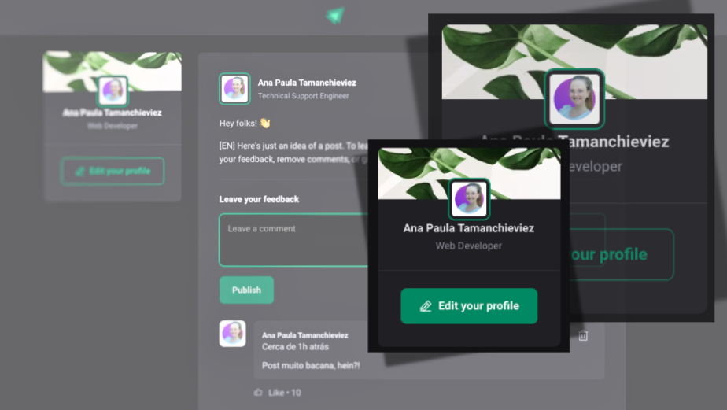

<h1 align="center"> Feed - Ignite </h1>

React training provided by the Rocketseat company.

  <a href="#-tecnologias">Tecnologias</a>&nbsp;&nbsp;&nbsp;|&nbsp;&nbsp;&nbsp;
  <a href="#-projeto">Projeto</a>&nbsp;&nbsp;&nbsp;|&nbsp;&nbsp;&nbsp;
  <a href="#-layout">Layout</a>&nbsp;&nbsp;&nbsp;|&nbsp;&nbsp;&nbsp;
  <a href="#memo-licença">Licença</a>

  

 

  

## 🚀 Tecnologias

Esse projeto foi desenvolvido com as seguintes tecnologias:

- HTML e CSS
- TypeScript
- React
- Git e Github
- Figma

## 💻 Projeto

The Feed-Ignite is a post feed project, where you can make comments in the posts.
Same project as https://github.com/AnaPaulaTamanchieviez/Feed but, but adapted with typescript instead of javascript.

## :memo: Licença

Esse projeto está sob a licença MIT.

---

Feito com ♥ 
